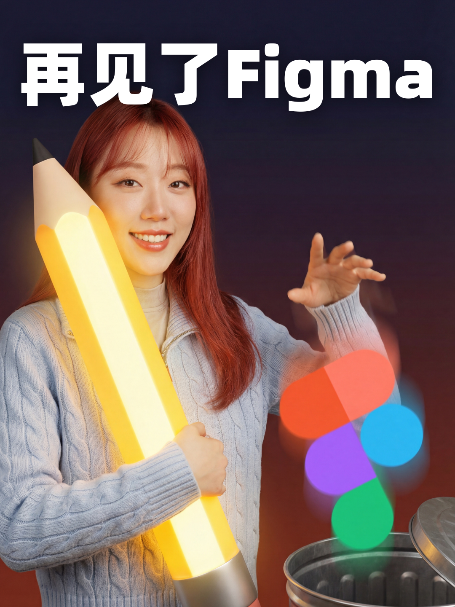
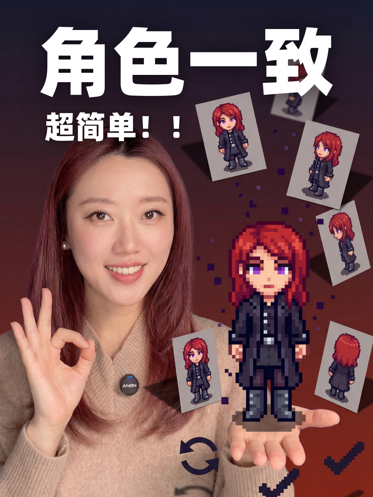
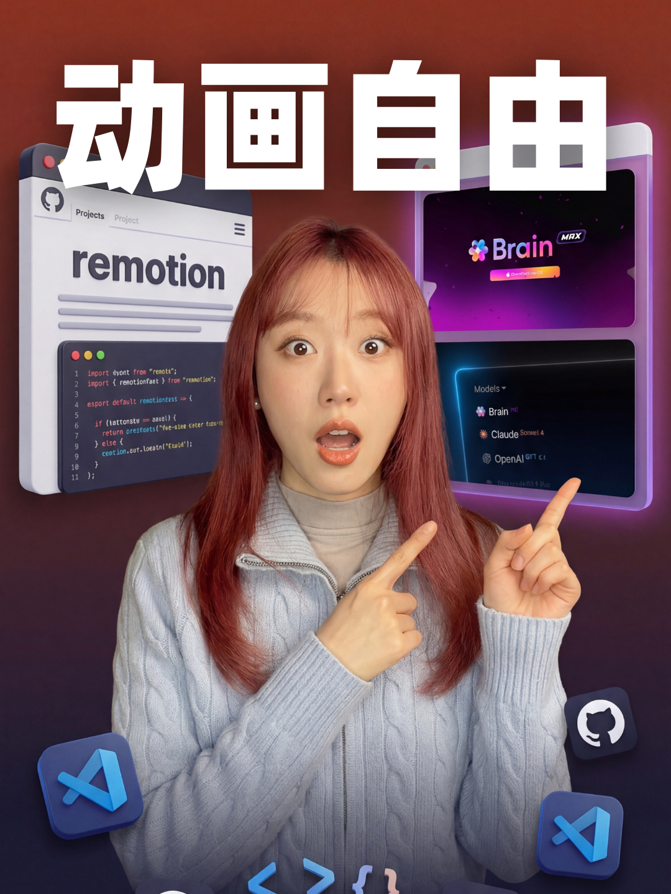
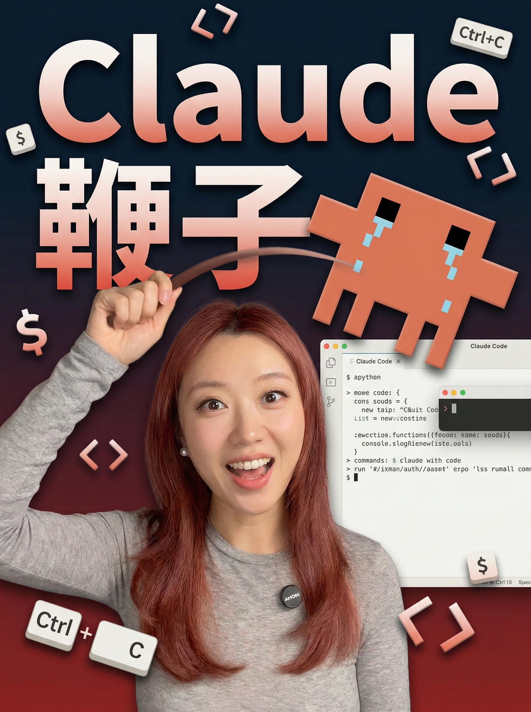
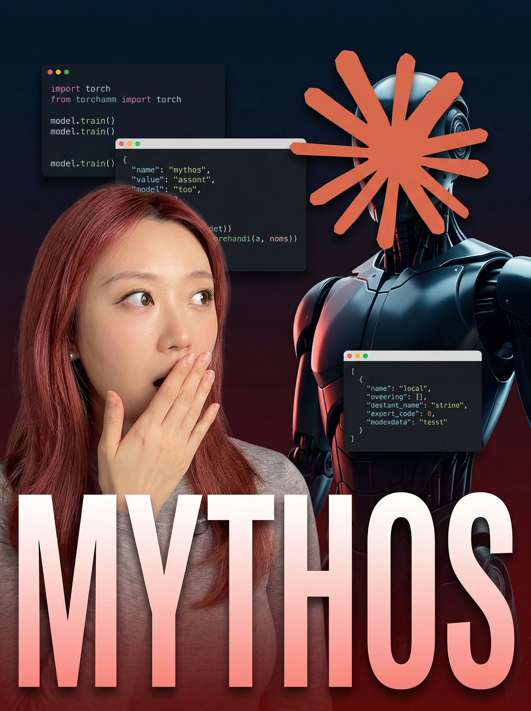

# cover-xiaohongshu

小红书封面生成 Skill。唤醒词：**小红书封面**。

把文章扔给 agent，它读完内容、问你几个问题，然后输出一段可以直接跑图的小红书封面提示词，或在 Codex 中调用图片生成能力直接生成小红书封面图。标题自动帮你想，构图逻辑、质量判断和迭代规则都内置好了。

支持 Claude Code、Codex，以及任何支持自定义 skill 的 AI agent。

---

## 三种模式

| 模式 | 用途 |
|------|------|
| prompt_mode | 只生成封面提示词，拿去给图片模型跑图 |
| image_mode | 生成提示词后，在 Codex 中直接调用图片生成能力出封面图 |
| production_mode | 面向发布场景，优先生成无字底图，再用确定性排版叠加清晰中文标题 |

---

## 持久进化

这个 Skill 支持持久进化，但不会每次生成都直接改写 `SKILL.md`。

默认节奏：

```text
每次生成 → 输出本轮记忆
用户要求记录/复盘/升级 → 写入 memory/
多次重复 → 进入 rule-candidates
规律稳定 → 晋升到 references
核心流程变化 → 再升级 SKILL.md
```

相关文件：

```text
references/evolution-policy.md
memory/evolution-log.md
memory/rule-candidates.md
memory/deprecated-rules.md
```

---

## 效果

<table>
  <tr>
    <td></td>
    <td></td>
    <td></td>
    <td></td>
  </tr>
  <tr>
    <td></td>
    <td></td>
    <td></td>
    <td></td>
  </tr>
</table>

---

## 怎么用

把文章内容发给 agent，skill 自动触发，然后一个问题一个问题地问你：

选哪种构图风格、有没有人脸参考图、人物表情、有没有产品截图要放进去、背景色调、字体……

问完，输出提示词或直接生成封面图。不需要懂设计，不需要自己写提示词。

也可以直接给结构化参数：

```yaml
article: "文章内容..."
platform: "xiaohongshu"
mode: "image_mode"
style: "auto"
title: ""
person:
  description: "年轻女性，科技博主气质"
assets:
  - "产品界面截图"
emotion: "好奇"
```

---

## 10 种构图风格

| 风格 | 适合什么 |
|------|---------|
| 深色渐变风 | 人物居中，大字压在后面，冲击力最强 |
| 纯色扁平风 | 干净清爽，人物 + 道具 + 纯色背景 |
| 产品主视觉风 | 有 UI 截图或产品图时首选，截图占主体 |
| 对比卡片风 | 前后对比、好坏对比类内容专用 |
| 极简留白风 | 大留白，标题是唯一焦点，克制感强 |
| 海报拼贴风 | 素材多的时候用，多层叠加，纵深感强 |
| 人物侧置留白风 | 人物偏一侧，另一边全给标题，大气 |
| 背影构图风 | 人物背对镜头，适合励志、启发类内容 |
| 局部出镜风 | 只露手或半张脸，产品是绝对主角 |
| 正面对视风 | 直视镜头，眼神接触，情绪直接 |

---

## 安装

```bash
git clone https://github.com/hongfamonvAI/oh-my-cover-design.git \
  ~/.claude/skills/cover-xiaohongshu
```

只想要 SKILL.md：

```bash
mkdir -p ~/.claude/skills/cover-xiaohongshu
curl -o ~/.claude/skills/cover-xiaohongshu/SKILL.md \
  https://raw.githubusercontent.com/hongfamonvAI/oh-my-cover-design/main/SKILL.md
```

---

## 关于参考图

- **图1**：你自己的人脸照，skill 会在提示词里保持五官一致性
- **图2 起**：想放进封面的任何素材——产品图、UI 截图、品牌资产都行

---

## License

MIT
